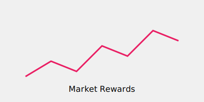

# Finance and Trading

PPO acts as an optimization engine for automated trading agents.

## Overview
Allows for stable sequential decision-making in volatile market environments.

## Diagram

## References
- [FinRL: A Deep Reinforcement Learning Library for Automated Stock Trading (2020)](https://arxiv.org/abs/2011.03907)
