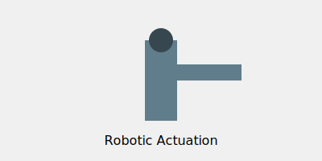

# Robotics and Control

PPO is heavily used in robotic locomotion and navigation.

## Overview
Excels in continuous action spaces required for smooth robot movements.

## Diagram

## References
- [Learning Dexterity (2018)](https://arxiv.org/abs/1808.00177)
