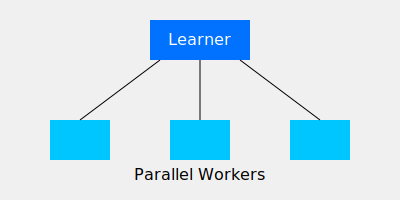

# Async PPO

Async PPO distributes data collection across multiple parallel workers.

## Overview
Dramatically speeds up training by parallelizing the environment interaction.

## Diagram

## References
- [Emergence of Locomotion Behaviours in Rich Environments (2017)](https://arxiv.org/abs/1707.02286)
