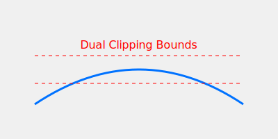

# Dual-Clip PPO

Dual-Clip PPO adds a secondary clipping mechanism to handle extreme value spikes.

## Overview
This variant is particularly useful in large-scale distributed training like MOBA games.

## Diagram

## References
- [Mastering Complex Control in MOBA Games with Deep Reinforcement Learning (2019)](https://arxiv.org/abs/1912.09729)
