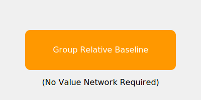

# GRPO (Group Relative Policy Optimization)

GRPO is an evolution of PPO used in advanced LLM post-training.

## Overview
Eliminates the value network by using group average as the baseline.

## Diagram

## References
- [DeepSeekMath: Pushing the Limits of Mathematical Reasoning in Open Language Models (2024)](https://arxiv.org/abs/2402.03300)
