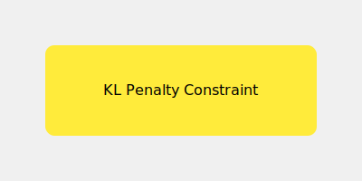

# PPO-Penalty

PPO-Penalty is a variant that uses an adaptive KL divergence penalty.

## Overview
Conceptually closer to TRPO, it applies a mathematical penalty to the KL divergence in the objective function.

## Diagram

## References
- [Proximal Policy Optimization Algorithms (2017)](https://arxiv.org/abs/1707.06347)
