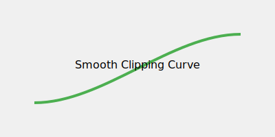

# PPOS (PPO Smoothed)

PPOS utilizes functional, smooth clipping instead of flat clipping.

## Overview
Achieves more accurate and stable updates by using a smooth function for clipping.

## Diagram

## References
- [Proximal Policy Optimization Smoothed Algorithm (2020)](https://arxiv.org/abs/2012.02439)
