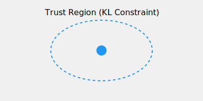

# TRPO (Trust Region Policy Optimization)

TRPO is the predecessor to PPO, using second-order optimization.

## Overview
Ensures monotonic improvement by constraining KL divergence.

## Diagram

## References
- [Trust Region Policy Optimization (2015)](https://arxiv.org/abs/1502.05477)
